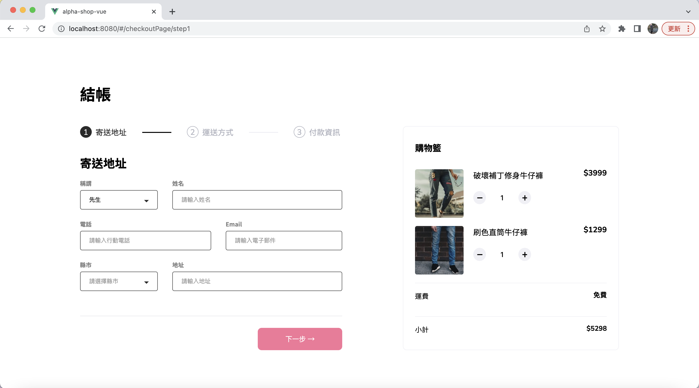
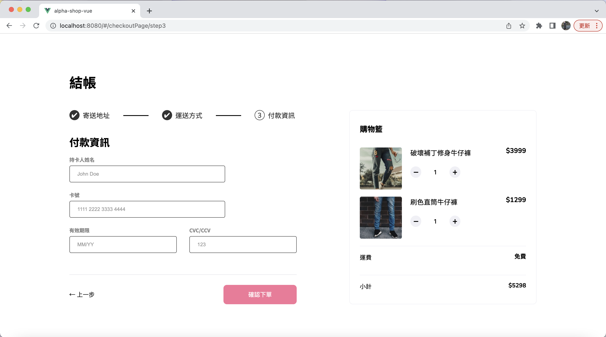
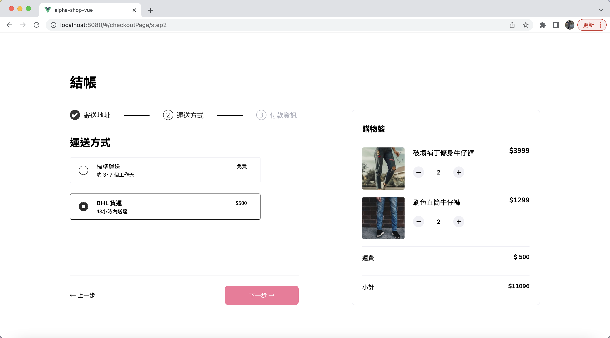

# alpha-shop-vue
+ Use the vue framework to practice alpha-shop project.

## ScreenShots
* Step1 checkoutAddress Page


* Step2 checkoutDelivery Page


* Step3 checkoutPayment Page


* Cart calc example


## Project setup
```
npm install
```

### Compiles and hot-reloads for development
```
npm run serve
```

### Compiles and minifies for production
```
npm run build
```

### Lints and fixes files
```
npm run lint
```

### Customize configuration
See [Configuration Reference](https://cli.vuejs.org/config/).
